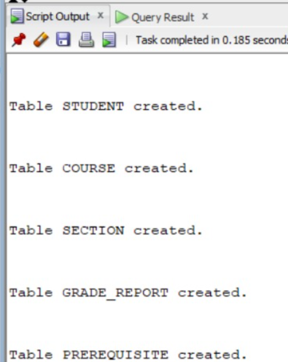
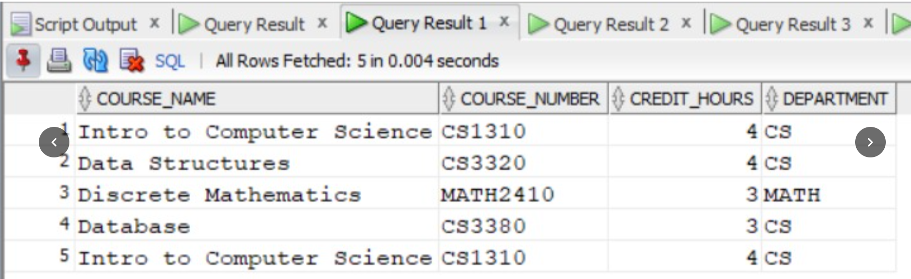

#.A.1. Create tables without constraints
```
CREATE TABLE STUDENT (
    Name VARCHAR2(20),
    Student_number NUMBER,
    Class NUMBER,
    Major VARCHAR2(20)
);

CREATE TABLE COURSE (
    Course_name VARCHAR2(40),
    Course_number VARCHAR2(10),
    Credit_hours NUMBER,
    Department VARCHAR2(20)
);

CREATE TABLE SECTION (
    Section_identifier NUMBER,
    Course_number VARCHAR2(10),
    Semester VARCHAR2(10),
    Year NUMBER,
    Instructor VARCHAR2(20)
);

CREATE TABLE GRADE_REPORT (
    Student_number NUMBER,
    Section_identifier NUMBER,
    Grade CHAR(1)
);

CREATE TABLE PREREQUISITE (
    Course_number VARCHAR2(10),
    Prerequisite_number VARCHAR2(10)
);
```

```
```
#.A.2. Insert all values
```
STUDENT
INSERT INTO STUDENT VALUES ('Smith',17,1,'CS');
INSERT INTO STUDENT VALUES ('Brown',8,2,'CS');
COURSE
INSERT INTO COURSE VALUES
('Intro to Computer Science','CS1310',4,'CS');

INSERT INTO COURSE VALUES
('Data Structures','CS3320',4,'CS');

INSERT INTO COURSE VALUES
('Discrete Mathematics','MATH2410',3,'MATH');

INSERT INTO COURSE VALUES
('Database','CS3380',3,'CS');
SECTION
INSERT INTO SECTION VALUES
(85,'MATH2410','Fall',7,'King');

INSERT INTO SECTION VALUES
(92,'CS1310','Fall',7,'Anderson');

INSERT INTO SECTION VALUES
(102,'CS3320','Spring',8,'Knuth');

INSERT INTO SECTION VALUES
(112,'MATH2410','Fall',8,'Chang');

INSERT INTO SECTION VALUES
(119,'CS1310','Fall',8,'Anderson');

INSERT INTO SECTION VALUES
(135,'CS3380','Fall',8,'Stone');
GRADE_REPORT
INSERT INTO GRADE_REPORT VALUES (17,112,'B');
INSERT INTO GRADE_REPORT VALUES (17,119,'C');
INSERT INTO GRADE_REPORT VALUES (8,85,'A');
INSERT INTO GRADE_REPORT VALUES (8,92,'A');
INSERT INTO GRADE_REPORT VALUES (8,102,'B');
INSERT INTO GRADE_REPORT VALUES (8,135,'A');
PREREQUISITE
INSERT INTO PREREQUISITE VALUES ('CS3380','CS3320');
INSERT INTO PREREQUISITE VALUES ('CS3380','MATH2410');
INSERT INTO PREREQUISITE VALUES ('CS3320','CS1310');
```

...
...

#.A.3. Describe all tables
...

DESC STUDENT;
DESC COURSE;
DESC SECTION;
DESC GRADE_REPORT;
DESC PREREQUISITE;
...


...
...

#.A.4. List the created tables
...

SELECT TABLE_NAME
FROM USER_TABLES;
...

...
...

#.A.5. Display values of each table
...

SELECT * FROM STUDENT;

SELECT * FROM COURSE;

SELECT * FROM SECTION;

SELECT * FROM GRADE_REPORT;

SELECT * FROM PREREQUISITE;
...

...
...

#.A.6. Delete all tables
...

If there are no foreign-key constraints:

DROP TABLE STUDENT;
DROP TABLE COURSE;
DROP TABLE SECTION;
DROP TABLE GRADE_REPORT;
DROP TABLE PREREQUISITE;
...
 
...
...
#.B.1 Create tables with constraints
```
STUDENT
CREATE TABLE STUDENT (
    Name VARCHAR2(20),
    Student_number NUMBER PRIMARY KEY,
    Class NUMBER,
    Major VARCHAR2(20) NOT NULL
);
COURSE
CREATE TABLE COURSE (
    Course_name VARCHAR2(40),
    Course_number VARCHAR2(10) PRIMARY KEY,
    Credit_hours NUMBER NOT NULL,
    Department VARCHAR2(20)
);
SECTION
CREATE TABLE SECTION (
    Section_identifier NUMBER PRIMARY KEY,
    Course_number VARCHAR2(10),
    Semester VARCHAR2(10) NOT NULL,
    Year NUMBER,
    Instructor VARCHAR2(20)
);
GRADE_REPORT
CREATE TABLE GRADE_REPORT (
    Student_number NUMBER,
    Section_identifier NUMBER,
    Grade CHAR(1) NOT NULL,

    PRIMARY KEY (Student_number, Section_identifier),

    FOREIGN KEY (Student_number)
        REFERENCES STUDENT(Student_number),

    FOREIGN KEY (Section_identifier)
        REFERENCES SECTION(Section_identifier)
);
PREREQUISITE
CREATE TABLE PREREQUISITE (
    Course_number VARCHAR2(10),
    Prerequisite_number VARCHAR2(10),

    PRIMARY KEY (Course_number, Prerequisite_number),

    FOREIGN KEY (Course_number)
        REFERENCES COURSE(Course_number)
);
```

```
```
#.B.2. Display description of each table
```
DESC STUDENT;
DESC COURSE;
DESC SECTION;
DESC GRADE_REPORT;
DESC PREREQUISITE;
```

```
```
#.B.3. Insert all values
```
Student
INSERT INTO STUDENT
VALUES ('Smith', 17, 1, 'CS');

INSERT INTO STUDENT
VALUES ('Brown', 8, 2, 'CS');
Course
INSERT INTO COURSE
VALUES ('Intro to Computer Science', 'CS1310', 4, 'CS');

INSERT INTO COURSE
VALUES ('Data Structures', 'CS3320', 4, 'CS');

INSERT INTO COURSE
VALUES ('Discrete Mathematics', 'MATH2410', 3, 'MATH');

INSERT INTO COURSE
VALUES ('Database', 'CS3380', 3, 'CS');
Section
INSERT INTO SECTION
VALUES (85, 'MATH2410', 'Fall', 7, 'King');

INSERT INTO SECTION
VALUES (92, 'CS1310', 'Fall', 7, 'Anderson');

INSERT INTO SECTION
VALUES (102, 'CS3320', 'Spring', 8, 'Knuth');

INSERT INTO SECTION
VALUES (112, 'MATH2410', 'Fall', 8, 'Chang');

INSERT INTO SECTION
VALUES (119, 'CS1310', 'Fall', 8, 'Anderson');

INSERT INTO SECTION
VALUES (135, 'CS3380', 'Fall', 8, 'Stone');
Grade_Report
INSERT INTO GRADE_REPORT
VALUES (17, 112, 'B');

INSERT INTO GRADE_REPORT
VALUES (17, 119, 'C');

INSERT INTO GRADE_REPORT
VALUES (8, 85, 'A');

INSERT INTO GRADE_REPORT
VALUES (8, 92, 'A');

INSERT INTO GRADE_REPORT
VALUES (8, 102, 'B');

INSERT INTO GRADE_REPORT
VALUES (8, 135, 'A');
Prerequisite
INSERT INTO PREREQUISITE
VALUES ('CS3380', 'CS3320');

INSERT INTO PREREQUISITE
VALUES ('CS3380', 'MATH2410');

INSERT INTO PREREQUISITE
VALUES ('CS3320', 'CS1310');

```

```
```
#.B.4. Display instances of each table
```
SELECT * FROM STUDENT;

SELECT * FROM COURSE;

SELECT * FROM SECTION;

SELECT * FROM GRADE_REPORT;

SELECT * FROM PREREQUISITE;
```

```
```
#.B.5. Add BRANCH attribute in STUDENT
```
ALTER TABLE STUDENT
ADD BRANCH VARCHAR2(20);

DESC STUDENT;
6. Copy MAJOR values into BRANCH and display
UPDATE STUDENT
SET BRANCH = MAJOR;

SELECT * FROM STUDENT;
```

```
```
#.B.7. Remove MAJOR attribute
```
ALTER TABLE STUDENT
DROP COLUMN MAJOR;

Check:

DESC STUDENT;
```

```
```
#.B.8. Change COURSE_NUMBER to CID in COURSE
```
ALTER TABLE COURSE
RENAME COLUMN COURSE_NUMBER TO CID;

Then:

DESC COURSE;
```

```
```
#.B.9. Change Database credit-hours to 4
```
UPDATE COURSE
SET CREDIT_HOURS = 4
WHERE COURSE_NAME = 'Database';

Display:

SELECT * FROM COURSE;
```

```
```
#.B.10. Put NOT NULL constraint on BRANCH
```
ALTER TABLE STUDENT
MODIFY BRANCH VARCHAR2(20) NOT NULL;

Check:

DESC STUDENT;
```

```
```
#.B.11. Rename STUDENT table to PUPIL
```
RENAME STUDENT TO PUPIL;

Check:

DESC PUPIL;

Important: After this command, there is no STUDENT table; its name is PUPIL.
```

```
```
#.B.12. Remove STUDENT table
```

Because Step 11 renamed it to PUPIL, use:

DROP TABLE PUPIL;

If your faculty wants the command specifically for the original table before renaming:

DROP TABLE STUDENT;
```

```
```
#.B.13. Remove rows having Fall semester
```
DELETE FROM SECTION
WHERE SEMESTER = 'Fall';

COMMIT;

Check:

SELECT * FROM SECTION;
```

```
```
#.B.14. Remove Data_Structures row from COURSE
```
DELETE FROM COURSE
WHERE COURSE_NAME = 'Data Structures';

COMMIT;

Check:

SELECT * FROM COURSE;
```

```
```
#.B.15. Remove all rows using TRUNCATE
```
TRUNCATE TABLE GRADE_REPORT;
TRUNCATE TABLE PREREQUISITE;
TRUNCATE TABLE SECTION;
TRUNCATE TABLE COURSE;
TRUNCATE TABLE STUDENT;

⚠️ If STUDENT was renamed, use:

TRUNCATE TABLE PUPIL;
```

```
```
#.B.16. Remove PUPIL, COURSE and SECTION to Recycle Bin
```
DROP TABLE PUPIL;
DROP TABLE COURSE;
DROP TABLE SECTION;

Check the recycle bin:

SHOW RECYCLEBIN;
```

```
```
#.B.17. Permanently remove GRADE_REPORT and PREREQUISITE
```
DROP TABLE GRADE_REPORT PURGE;

DROP TABLE PREREQUISITE PURGE;
```

```
```
