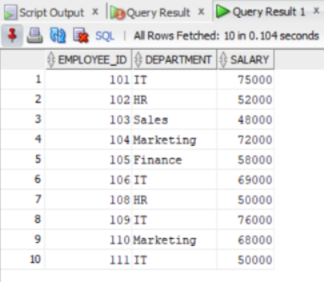

```
SET SERVEROUTPUT ON;

-- Create base EMPLOYEE table
CREATE TABLE EMPLOYEE
(
    EMPLOYEE_ID NUMBER(4) PRIMARY KEY,
    EMPLOYEE_NAME VARCHAR2(30),
    DEPARTMENT VARCHAR2(20),
    SALARY NUMBER(10,2)
);

-- Insert sample records
INSERT INTO EMPLOYEE VALUES (101, 'Rahul', 'HR', 35000);
INSERT INTO EMPLOYEE VALUES (102, 'Sneha', 'Sales', 42000);
INSERT INTO EMPLOYEE VALUES (103, 'Arjun', 'Finance', 45000);


-- Create view
CREATE OR REPLACE VIEW EMPLOYEE_VIEW AS
SELECT EMPLOYEE_ID,
       EMPLOYEE_NAME,
       DEPARTMENT,
       SALARY
FROM EMPLOYEE;

-- Create INSTEAD OF UPDATE trigger
CREATE OR REPLACE TRIGGER TRG_UPDATE_VIEW
INSTEAD OF UPDATE
ON EMPLOYEE_VIEW
FOR EACH ROW
BEGIN
    UPDATE EMPLOYEE
    SET EMPLOYEE_NAME = :NEW.EMPLOYEE_NAME,
        DEPARTMENT = :NEW.DEPARTMENT,
        SALARY = :NEW.SALARY
    WHERE EMPLOYEE_ID = :OLD.EMPLOYEE_ID;

    DBMS_OUTPUT.PUT_LINE(
        'Employee record updated through the view.'
    );
END;
/

-- Update employee through the view
UPDATE EMPLOYEE_VIEW
SET SALARY = 40000
WHERE EMPLOYEE_ID = 101;


-- Display base table
SELECT EMPLOYEE_ID, DEPARTMENT, SALARY FROM EMPLOYEE;
```

```
```
